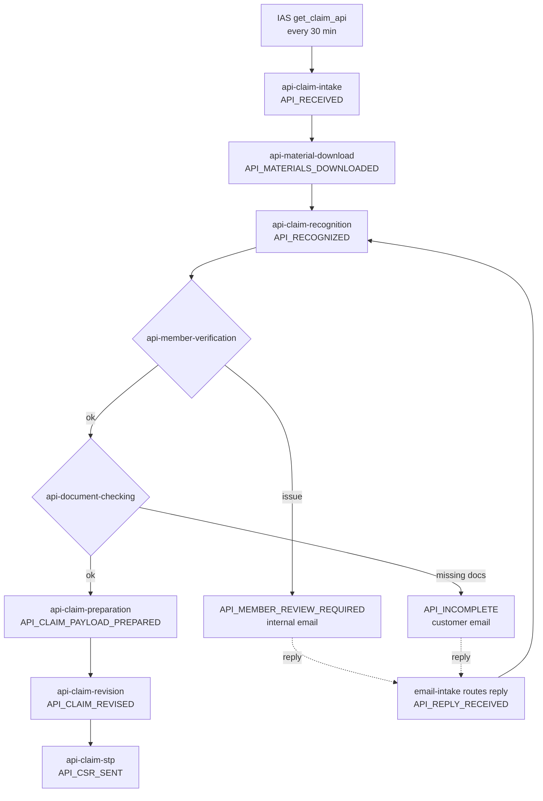
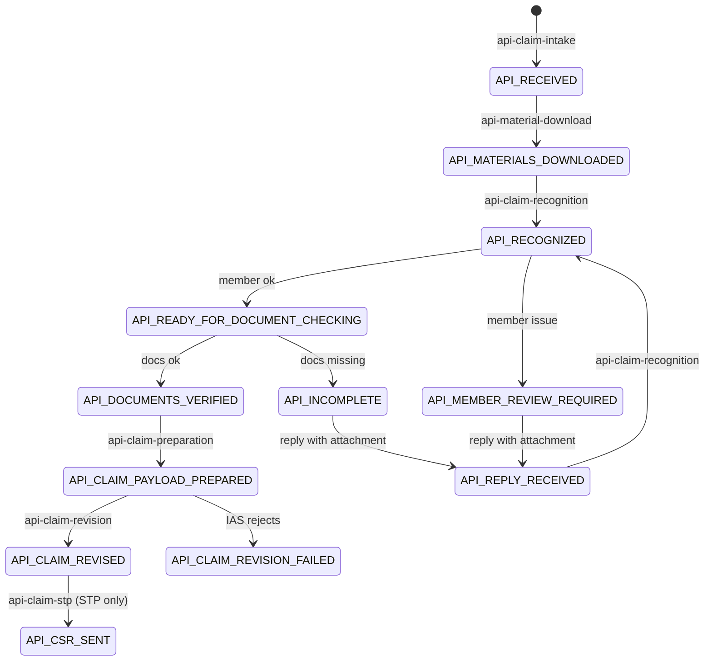

# API Case Workflow

Developer reference for how API cases move through the system: where they come from, which jobs touch them, how
they stay separate from email cases, and how customer email replies bring them back into the workflow.

- Email case workflow: [jobs-registry.md](jobs-registry.md)
- Delivery phases, decisions and open questions: [API_CASE_IMPLEMENTATION_PLAN.md](../demo/API%20DAY1/API_CASE_IMPLEMENTATION_PLAN.md)

> **Build status.** Most of this workflow is not built yet. Each section and job shows its phase. Update this file
> in the same change that builds or changes a job, so it always describes the system as it actually is.

---

## 1. What an API case is

The system handles two kinds of case. They share one database table, one inbox and the same business rules, but
each has its own jobs.

| | Email case | API case |
|---|---|---|
| Starts from | A new email in the inbox | A claim listed by IAS `get_claim_api` |
| Documents | Email attachments | Console images (via ulink-console-middleware) + attachments from customer replies |
| IAS action | Create a claim (`CL_CLAIM_API`) | Revise an existing claim (the claim already exists in IAS) |
| Orchestrator | `POST /api/jobs/pipeline/run` | `POST /api/jobs/api-pipeline/run` |
| `ulink_cases.source` | `EMAIL` | `API` |
| Statuses | `EMAIL_RECEIVED`, `RECOGNIZED`, … | Always prefixed `API_` |

### Terms

| Term | Meaning | Example |
|---|---|---|
| `clNo` | IAS claim number. Stored in `ulink_cases.claim_no` | `2604050015` |
| `tpaCaseNumber` | TPA case reference from IAS. Unique. Stored in `ulink_cases.tpa_case_number` | `STEVENEVERHILLC58` |
| scanId | Console scan id; the search key for the case's images in the middleware | `API-AYA-CL-26034880` |
| submission | One console upload under a scanId, with its own barcode. A scanId can have several (`-01`, `-02`) | `API-AYA-CL-26034880-01` |
| material | One page image of a submission, downloaded from the graph service by id | `page-000.jpg` |

## 2. End-to-end flow



In words:

1. Every 30 minutes the API orchestrator asks IAS for API claims created today (Myanmar time), and creates one case
   per new `clNo`.
2. It downloads that claim's page images from the console.
3. OCR reads the images.
4. Member check, then document check. If either fails, an email goes out and the case waits.
5. When the customer replies, the reply's attachments are added and the case goes back to OCR with the console
   images plus the new attachments.
6. Once both checks pass, the claim payload is prepared and sent to IAS as a **claim revision**. It is never a new
   claim, because `clNo` already exists in IAS.
7. STP claims continue to the settlement report.

## 3. Rules that keep API and email cases apart

These are the invariants. Any change that could break one needs a test proving it still holds.

| # | Rule | Enforced by |
|---|---|---|
| 1 | Every case has `source` = `EMAIL` or `API`, set at creation and never changed | Column default `EMAIL`; only `api-claim-intake` writes `API` |
| 2 | An API case only ever holds `API_*` statuses, and an email case never does | DB check: `(source = 'API') = (current_status LIKE 'API\_%')` |
| 3 | Email jobs never select API cases | They filter on exact email statuses, which rule 2 makes impossible for API cases. **Email job queries need no `source` filter**; don't add `API_*` handling to them |
| 4 | API jobs never select email cases | Every API job filters `source = 'API'` **and** its `API_*` status |
| 5 | An incoming email reaches the right case | `email-intake` routing (section 7.2) |
| 5a | Each email is stored on **exactly one** case (API or email) and marked `\Seen` only **after** it is stored on that case. If storing fails it stays unread and is retried | `email-intake` is the only inbox reader; it dedupes on `ulink_email_messages` (`source` + `externalId`) and flags `\Seen` after the store succeeds |
| 6 | One IAS claim becomes at most one case | Unique indexes on `claim_no` and `tpa_case_number` where `source = 'API'` |
| 7 | An API case is never sent to IAS claim creation | Rule 2: `ias-claim-creation` only reads `CLAIM_PAYLOAD_PREPARED` |

Rules 1, 2 and 6 are **built** (migration `20260924100000-add-api-case-source.js`; constraint names
`ulink_cases_source_check`, `ulink_cases_source_status_match`, indexes `ulink_cases_api_claim_no_unique`,
`ulink_cases_api_tpa_case_number_unique`). Tests: `tests/caseSourceConstraint.test.js` checks them against the real
DB; `tests/emailJobIsolation.test.js` runs every email job and fails if one selects cases without an exact,
non-`API_` status filter. **Adding a new email job? Add it to that test's `EMAIL_JOBS`.**

Rule 2 is the one that makes the rest safe. Even a bug or a manual `UPDATE` can't put an API case into an email
status, so the email pipeline can't pick it up.

## 4. Case lifecycle



| Status | Meaning | Set by | Picked up by | Phase |
|---|---|---|---|---|
| `API_RECEIVED` | New claim from IAS; no images yet | `api-claim-intake` | `api-material-download` | 1 |
| `API_MATERIALS_DOWNLOADED` | Console images saved locally | `api-material-download` | `api-claim-recognition` | 3 |
| `API_REPLY_RECEIVED` | Customer replied with attachments while the case was waiting | `email-intake` | `api-claim-recognition` | 4 |
| `API_RECOGNIZED` | OCR done | `api-claim-recognition` | `api-member-verification` | 5 |
| `API_NOT_RECOGNIZED` / `API_MANUAL_REVIEW` | OCR couldn't classify the documents | `api-claim-recognition` | operator | 5 |
| `API_MEMBER_REVIEW_REQUIRED` | Member/coverage issue; internal email sent. **Waits for a reply** | `api-member-verification` | `email-intake` (on reply) | 6 |
| `API_READY_FOR_DOCUMENT_CHECKING` | Member check passed | `api-member-verification` | `api-document-checking` | 6 |
| `API_INCOMPLETE` | Documents missing; customer email sent. **Waits for a reply** | `api-document-checking` | `email-intake` (on reply) | 6 |
| `API_DOCUMENTS_VERIFIED` | Both checks passed | `api-document-checking` | `api-claim-preparation` | 6 |
| `API_CLAIM_PAYLOAD_PREPARED` | Revision payload built | `api-claim-preparation` | `api-claim-revision` | 7 |
| `API_CLAIM_REVISED` | IAS accepted the revision | `api-claim-revision` | `api-claim-stp` | 8 |
| `API_CLAIM_REVISION_FAILED` | IAS rejected the revision (business answer; not retried) | `api-claim-revision` | operator | 8 |
| `API_CSR_SENT` | Settlement report sent (STP only) | `api-claim-stp` | end | 9 |

Statuses from Phase 3 onward are provisional until their phase is built.

## 5. Orchestrator and scheduling

**Built (Phase 2).** Today's steps (`API_STEPS` in `modules/pipeline/service.js`):

```
POST /api/jobs/api-pipeline/run        cron: every 30 minutes; lock 'api-pipeline'
  1. api-claim-intake
  2. api-material-download
```

Endpoints: `/api/jobs/api-pipeline/run`, `/release`, `/runs`, `/runs/:id` — they only ever see `pipeline='API'`
runs (`ulink_pipeline_runs.pipeline`). The email orchestrator (`/api/jobs/pipeline/*`, lock `pipeline`) is unchanged
and only sees `EMAIL` runs. The console shows each on its own tab (`?source=api`), and the cases list likewise.

Planned full order, as each phase adds its job:

```
  1. api-claim-intake
  2. email-intake              shared with the email pipeline      (Phase 4)
  3. api-material-download
  4. api-claim-recognition                                         (Phase 5)
  5. api-member-verification                                       (Phase 6)
  6. api-document-checking                                         (Phase 6)
  7. email-sender              shared                              (Phase 6)
  8. api-claim-preparation                                         (Phase 7)
  9. api-claim-revision                                            (Phase 8)
 10. api-claim-stp                                                 (Phase 9)
 11. email-sender              shared                              (Phase 9)
```

- **Same runner as the email pipeline.** `modules/pipeline/service.js` gives each step a lock, a timeout and a
  `ulink_pipeline_run_steps` row. The API pipeline passes its own step list; runs are stored with
  `pipeline = 'API'`.
- **No branching in the orchestrator.** Every step runs every time, and each job only picks up cases in its own
  status. A case that one step moves forward is visible to the next step in the same run.
- **Shared jobs** (`email-intake`, `email-sender`) run in both pipelines with the **same lock**. If the email
  pipeline is running one of them, the API pipeline's step is `SKIPPED`, which is normal. The next run catches up.
- **Why `email-intake` is a step here:** there is only one inbox, so there must be only one reader. Two readers
  would compete over unread messages. Running the shared reader from both pipelines means API replies are picked up
  on the API schedule too.
- Every job also has its own `POST /api/jobs/<name>/run` and `/release`, for testing or re-running one step.

## 6. Jobs

Each job reads the previous job's output from `ulink_cases` and writes its own. None of them call each other.

### 6.1 `api-claim-intake` (Phase 1)

| | |
|---|---|
| Module | `modules/api-claim-intake/` (`iasClient.js`, `service.js`) |
| Status | **Built** 2026-09-24. Job: `POST /api/jobs/api-claim-intake/run` (today). Tests: `tests/apiClaimIntake.test.js` |
| Test endpoint | `GET /api/dev/api-claim-intake/preview?dateFrom=YYYY-MM-DD&dateTo=YYYY-MM-DD` (real IAS call, saves nothing) |
| Calls | `GET {IAS_URL}{GET_CLAIM_API}?dateFrom=YYYY-MM-DD&dateTo=YYYY-MM-DD` |
| Selects | Nothing from the DB; the input is the IAS list |
| Writes | New row: `source='API'`, `claim_no`, `tpa_case_number`, `ias_api_claim` (raw IAS row), `current_status='API_RECEIVED'`, plus a `ulink_case_events` row |
| Returns | `{ fetched, inserted, skippedExisting, skippedInvalid }` |

Logic:

1. Date range defaults to **today in Myanmar time (UTC+6:30)** for both `dateFrom` and `dateTo`
   (`todayInIasTimezone()` in `modules/shared/iasDates.js`). It is computed in `Asia/Yangon` explicitly because the
   server runs on WIB (UTC+7), whose date is already tomorrow between 00:00 and 00:30 Myanmar time.
   **Known gap:** a claim created after the day's last run (e.g. 23:31–23:59) is not picked up automatically. Catch it
   by running the day again with an explicit range; duplicates are blocked by step 3.
2. Call IAS. On a timeout, a non-2xx response or `success: false`, write nothing and end the run. The next run
   retries the same range.
3. Create each claim's case with `Case.findOrCreate` on (`source='API'`, `claim_no`), in one transaction with its
   `ulink_case_events` row. The unique indexes are the real guard: a clash (e.g. the same `tpaCaseNumber` under a
   new `clNo`) fails that claim and is reported in `errors`; it is never merged into the existing case. A claim that already exists is left alone: its status stays
   wherever later jobs moved it.
4. A row without `clNo` or `tpaCaseNumber` is skipped and logged. The rest of the list is still inserted.

### 6.2 `email-intake` (shared, API behavior from Phase 4)

See section 7.2.

### 6.3 `api-material-download` (Phase 3, built 2026-09-24)

| | |
|---|---|
| Module | `modules/api-material-download/` (`middlewareClient.js`, `service.js`) |
| Job | `POST /api/jobs/api-material-download/run` |
| Selects | `source='API' AND current_status='API_RECEIVED'`, oldest first, `API_MATERIAL_DOWNLOAD_BATCH_LIMIT` per run |
| Calls | ulink-console-middleware (`CONSOLE_MIDDLEWARE_URL`): `GET /api/files/materials?scanId=…` (all pages), then `POST /api/files/download/zip` |
| Writes | Files under `API_MATERIAL_DOWNLOAD_ROOT/<scanId>/<barcodeId>/<file>`; `api_materials_result`; a `ulink_case_events` row |
| Next | `API_MATERIALS_DOWNLOADED` |
| Tests | `tests/apiMaterialDownload.test.js` |

Logic:

1. **scanId = `API-{tpaCaseNumber}`.**
2. **List every page** of the scan's submissions. The middleware's scanId search is a *contains* match
   (`API-X68` also returns `API-X688-01`), so only the exact scanId and its numbered submissions (`API-X68-01`,
   `API-X68-02`) are kept.
3. **Download all submissions as zips** (at most 100 images per request, the middleware's limit) and unpack them
   into this app's own folder. The images end up on ulink-api's side even when the middleware runs on another
   server. The scan's folder is emptied first, so a retry can't leave stale files. Every zip entry must resolve
   inside the folder, or the case fails.
4. **Save `api_materials_result`:**
   ```json
   { "scanId": "API-AYA-CL-26034880", "folder": "<absolute path>", "fileCount": 7,
     "barcodes": [ { "barcodeId": "VSQ9N14552", "scanId": "API-AYA-CL-26034880-01", "createdAt": "…",
                     "expected": 7, "files": ["API-AYA-CL-26034880/VSQ9N14552/page-000.jpg", "…"] } ],
     "downloadedAt": "…" }
   ```
   Every barcode is kept here. `expected` is how many images the console listed; if `files` has fewer, some images
   failed to download. `console_barcode` is **not** set yet: which barcode claim revision needs is decided in
   Phase 8.
5. **No images in the console** is not an error. The case still moves on with `fileCount: 0`. Documents then come
   from the customer's email reply, and document checking asks for what's missing (same as email cases).
6. **Middleware down, timeout, or every image failing:** the case stays at `API_RECEIVED` and is retried next run.

### 6.4 `api-claim-recognition` (Phase 5)

Selects `API_MATERIALS_DOWNLOADED` and `API_REPLY_RECEIVED`. Documents are the downloaded console images plus the
attachments of every inbound reply on the case. It reuses the existing recognition logic; only the document
gathering is API-specific. Writes `extracted_fields`.

### 6.5 `api-member-verification` and `api-document-checking` (Phase 6)

Same order and the same rules as the email workflow, reusing `member-verification/checks.js`,
`member-verification/iasClient.js` and `document-checking/checklist.js`. A member-check issue queues an **internal**
email; missing documents queue a **customer** email. Writes `member_verify_result`, `ias_member_info_response`,
`document_check_result`.

### 6.6 `api-claim-preparation` (Phase 7)

Reuses the diagnosis/benefit pickers and STP eligibility. Builds the claim revision payload. Writes
`ias_claim_payload`, `claim_prep_meta`.

### 6.7 `api-claim-revision` (Phase 8)

Sends the revision to IAS: updates barcode, diagnosis and benefit, sets pend codes (`IAS_CL_PEND_CODE`) when needed,
and validates. A business rejection → `API_CLAIM_REVISION_FAILED`, not retried. A technical failure → stays at
`API_CLAIM_PAYLOAD_PREPARED` and is retried. Waiting for the IAS sample.

### 6.8 `api-claim-stp` (Phase 9)

STP claims: fetch the settlement report like `ias-claim-stp`. Non-STP: manual approval. To be confirmed.

## 7. Email

### 7.1 Outgoing (Phase 4)

| Email | Sent when | To | How |
|---|---|---|---|
| Missing documents | `api-document-checking` → `API_INCOMPLETE` | Customer (a fixed personal address for now; the IAS member-info email later) | A **new** email the first time; a reply in the same thread after that |
| Member issue | `api-member-verification` → `API_MEMBER_REVIEW_REQUIRED` | Internal (same recipient as email cases) | New email / reply in thread |
| Revision done | `api-claim-revision` → `API_CLAIM_REVISED` | Internal | New email |

- The jobs only **queue** an `EmailTask`. The shared `email-sender` sends it.
- **Every API email's subject contains the `tpaCaseNumber`.** This is how a reply can still be matched when the
  reply headers are missing.
- The first email creates the case's `ulink_email_threads` row and stores our outgoing `Message-ID` in
  `ulink_email_messages`. Replies are matched against that id.

### 7.2 Incoming: which case does an email belong to? (Phase 4)

There is **one inbox for both kinds of case** and **one reader**, `email-intake`. Neither workflow picks or skips
emails by type: every unread email is decided exactly once. For each email:

1. Skip it if it is already stored (`ulink_email_messages.source` + `externalId`).
2. Find its case (below). It belongs to exactly one case, API or email.
3. Store it and its attachments on that case.
4. Only then mark it `\Seen`. If step 2 or 3 fails, it stays unread and the next run retries it.

Never mark an email seen before it is stored, and never mark it seen for one case type while leaving it for the
other: both would lose or duplicate replies.

Finding the case:

```
1. In-Reply-To / References header matches an email we sent?
      → that email's thread → its case
2. else, subject contains the tpaCaseNumber of an API case?
      → that API case
3. else
      → new email case (existing behavior)
```

Then, if the matched case is an **API case**:

| API case status | Email has attachments | Result |
|---|---|---|
| `API_INCOMPLETE` or `API_MEMBER_REVIEW_REQUIRED` | yes | Store the email and attachments → **`API_REPLY_RECEIVED`** |
| `API_INCOMPLETE` or `API_MEMBER_REVIEW_REQUIRED` | no | Store the email; status unchanged |
| any other `API_*` | either | Store and log only; status unchanged |

Email cases keep their existing logic (`AWAITING_CUSTOMER_STATUSES` in `modules/email-intake/service.js`). The API
branch only ever writes `API_*` statuses, so a reply can't move an API case into the email pipeline.

**Known gap:** a customer who sends a brand-new email with a different subject becomes a new email case (rule 3).
An operator has to link it by hand.

## 8. Data: columns API cases use on `ulink_cases`

| Column | Written by | Read by |
|---|---|---|
| `source` | `api-claim-intake` (`'API'`) | every API job, `email-intake`, console tabs |
| `claim_no` | `api-claim-intake` | `api-claim-revision`, `api-claim-stp`, console |
| `tpa_case_number` | `api-claim-intake` | `api-material-download`, `email-intake` (subject match), console |
| `ias_api_claim` | `api-claim-intake` | audit only |
| `api_materials_result` (incl. every barcode) | `api-material-download` | `api-claim-recognition` |
| `console_barcode` | decided in Phase 8 (which barcode revision needs) | `api-claim-preparation` |
| `extracted_fields` | `api-claim-recognition` | member / document checks, preparation |
| `member_verify_result`, `ias_member_info_response` | `api-member-verification` | preparation |
| `document_check_result` | `api-document-checking` | email tasks |
| `ias_claim_payload`, `claim_prep_meta`, `is_stp` | `api-claim-preparation` | `api-claim-revision`, `api-claim-stp` |
| `ias_claim_revision_result` | `api-claim-revision` | `api-claim-stp`, console |

Every status change is also written to `ulink_case_events`.

## 9. Failure handling

Same conventions as the email jobs:

| Kind | Example | What the job does |
|---|---|---|
| Technical | Timeout, network error, non-2xx, disk error | Leave the case at its current status; the next run retries. Log the error |
| Business answer | IAS returns `success: false` for a revision | Move to a failed/review status; **don't retry** automatically |
| Waiting | Console images not uploaded yet | Leave the case as is. This is normal, not an error |
| Bad input row | IAS list row missing `clNo` | Skip and log that row; continue with the rest |

One case failing never stops the batch: each job handles errors per case.

## 10. Adding or changing an API job

1. Put the logic in `modules/api-<name>/service.js` with a `run()`. Reuse existing business rules from their modules
   instead of copying them.
2. Select with `source = 'API'` **and** the `API_*` status it consumes. Write only `API_*` statuses.
3. Write the job's output to its own column. Read the previous job's output from its column.
4. Wire `POST /api/jobs/api-<name>/run` in `routes/jobs/index.js` via `createJobRouter`.
5. Add it to the API pipeline's step list, then to the console's API graph.
6. Tests: the happy path, a re-run doing nothing new, and the isolation test still passing.
7. Update sections 4, 6 and 8 of this file.

## 11. Operating and debugging

Find an API case:

```sql
SELECT id, current_status, claim_no, tpa_case_number, updated_at
FROM ulink_cases
WHERE source = 'API' AND (claim_no = '2604050015' OR tpa_case_number = 'STEVENEVERHILLC58');
```

Its history:

```sql
SELECT created_at, block_name, prev_status, new_status, reason_code, message
FROM ulink_case_events WHERE case_id = '<id>' ORDER BY created_at;
```

- **Run one step by hand:** `POST /api/jobs/<name>/run`.
- **A job is stuck as "already running"** after a crash: `POST /api/jobs/<name>/release`.
- **Reprocess a case:** `POST /api/dev/cases/reset` to an earlier `API_*` status. The DB check rejects a reset to
  an email status.
- **API case appears in the Email tab:** `source` is wrong, which rule 1 should make impossible. Investigate before
  fixing the data.
