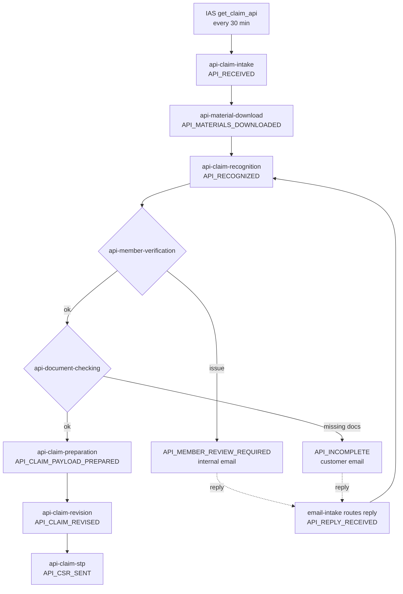
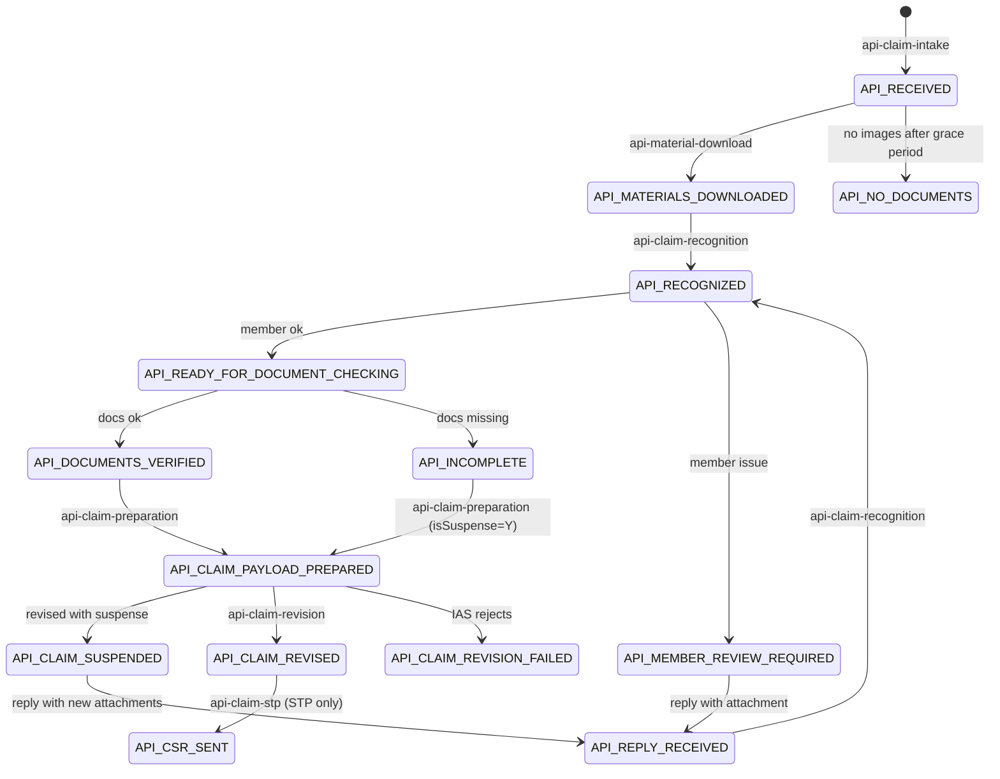

# API Case Workflow

Developer reference for how API cases move through the system: where they come from, which jobs touch them, how
they stay separate from email cases, and how customer email replies bring them back into the workflow.

- Email case workflow: [jobs-registry.md](jobs-registry.md)
- Delivery phases, decisions and open questions: [API_CASE_IMPLEMENTATION_PLAN.md](../demo/API%20DAY1/API_CASE_IMPLEMENTATION_PLAN.md)

> **Build status.** Most of this workflow is not built yet. Each section and job shows its phase. Update this file
> in the same change that builds or changes a job, so it always describes the system as it actually is.

---

## 1. What an API case is

The system handles two kinds of case. They share one database table, one inbox and the same business rules, but
each has its own jobs.

| | Email case | API case |
|---|---|---|
| Starts from | A new email in the inbox | A claim listed by IAS `get_claim_api` |
| Documents | Email attachments | Console images (via ulink-console-middleware) + attachments from customer replies |
| IAS action | Create a claim (`CL_CLAIM_API`) | Revise an existing claim (the claim already exists in IAS) |
| Orchestrator | `POST /api/jobs/pipeline/run` | `POST /api/jobs/api-pipeline/run` |
| `ulink_cases.source` | `EMAIL` | `API` |
| Statuses | `EMAIL_RECEIVED`, `RECOGNIZED`, … | Always prefixed `API_` |

### Terms

| Term | Meaning | Example |
|---|---|---|
| `clNo` | IAS claim number. Stored in `ulink_cases.claim_no` | `2604050015` |
| `tpaCaseNumber` | TPA case reference from IAS. Unique. Stored in `ulink_cases.tpa_case_number` | `STEVENEVERHILLC58` |
| scanId | Console scan id; the search key for the case's images in the middleware | `API-AYA-CL-26034880` |
| submission | One console upload under a scanId, with its own barcode. A scanId can have several (`-01`, `-02`) | `API-AYA-CL-26034880-01` |
| material | One page image of a submission, downloaded from the graph service by id | `page-000.jpg` |

## 2. End-to-end flow



In words:

1. Every 30 minutes the API orchestrator asks IAS for API claims created today (Myanmar time), and creates one case
   per new `clNo`.
2. It downloads that claim's page images from the console and stores them as case documents (waiting up to 2 hours
   if the console has none yet).
3. OCR reads the images.
4. Member check, then document check. If either fails, an email goes out and the case waits.
5. When the customer replies, the reply's attachments are added and the case goes back to OCR with the console
   images plus the new attachments.
6. Once both checks pass, the claim payload is prepared and sent to IAS as a **claim revision**. It is never a new
   claim, because `clNo` already exists in IAS.
7. STP claims continue to the settlement report.

## 3. Rules that keep API and email cases apart

These are the invariants. Any change that could break one needs a test proving it still holds.

| # | Rule | Enforced by |
|---|---|---|
| 1 | Every case has `source` = `EMAIL` or `API`, set at creation and never changed | Column default `EMAIL`; only `api-claim-intake` writes `API` |
| 2 | An API case only ever holds `API_*` statuses, and an email case never does | DB check: `(source = 'API') = (current_status LIKE 'API\_%')` |
| 3 | Email jobs never select API cases | They filter on exact email statuses, which rule 2 makes impossible for API cases. **Email job queries need no `source` filter**; don't add `API_*` handling to them |
| 4 | API jobs never select email cases | Every API job filters `source = 'API'` **and** its `API_*` status |
| 5 | An incoming email reaches the right case | `email-intake` routing (section 7.2) |
| 5a | Each email is stored on **exactly one** case (API or email) and marked `\Seen` only **after** it is stored on that case. If storing fails it stays unread and is retried | `email-intake` is the only inbox reader; it dedupes on `ulink_email_messages` (`source` + `externalId`) and flags `\Seen` after the store succeeds |
| 6 | One IAS claim becomes at most one case | Unique indexes on `claim_no` and `tpa_case_number` where `source = 'API'` |
| 7 | An API case is never sent to IAS claim creation | Rule 2: `ias-claim-creation` only reads `CLAIM_PAYLOAD_PREPARED` |

Rules 1, 2 and 6 are **built** (migration `20260924100000-add-api-case-source.js`; constraint names
`ulink_cases_source_check`, `ulink_cases_source_status_match`, indexes `ulink_cases_api_claim_no_unique`,
`ulink_cases_api_tpa_case_number_unique`). Tests: `tests/caseSourceConstraint.test.js` checks them against the real
DB; `tests/emailJobIsolation.test.js` runs every email job and fails if one selects cases without an exact,
non-`API_` status filter. **Adding a new email job? Add it to that test's `EMAIL_JOBS`.**

Rule 2 is the one that makes the rest safe. Even a bug or a manual `UPDATE` can't put an API case into an email
status, so the email pipeline can't pick it up.

## 4. Case lifecycle



| Status | Meaning | Set by | Picked up by | Phase |
|---|---|---|---|---|
| `API_RECEIVED` | New claim from IAS; no images yet | `api-claim-intake` | `api-material-download` | 1 |
| `API_MATERIALS_DOWNLOADED` | Console images stored as case documents | `api-material-download` | `api-claim-recognition` | 3 |
| `API_NO_DOCUMENTS` | No console images after the grace period; the customer will be asked | `api-material-download` | document checking (email) | 2c / 6 |
| `API_REPLY_RECEIVED` | Customer replied with new attachments while the case was waiting | `api-reply-intake` | `api-claim-recognition` | 4 |
| `API_RECOGNIZED` | OCR done | `api-claim-recognition` | `api-member-verification` | 5 |
| `API_MANUAL_REVIEW` | Extraction didn't fit the `ayas_member_claim` schema; waits for an operator | `api-claim-recognition` | operator | 5 |
| `API_MEMBER_REVIEW_REQUIRED` | Member/coverage issue (internal email: 6c). Re-checked every run; **also waits for a reply** | `api-member-verification` | `api-member-verification` (re-check), `email-intake` (reply) | 6 |
| `API_READY_FOR_DOCUMENT_CHECKING` | Member check passed | `api-member-verification` | `api-document-checking` | 6 |
| `API_INCOMPLETE` | Documents missing; customer emailed. Continues to preparation (suspense) | `api-document-checking` | `api-claim-preparation` | 6 |
| `API_DOCUMENTS_VERIFIED` | Both checks passed | `api-document-checking` | `api-claim-preparation` | 6 |
| `API_CLAIM_PAYLOAD_PREPARED` | Revision payload built | `api-claim-preparation` | `api-claim-revision` | 7 |
| `API_CLAIM_SUSPENDED` | Revised in IAS with suspense (documents missing). **Waits for a reply** | `api-claim-revision` | `api-reply-intake` | 8 |
| `API_CLAIM_REVISED` | IAS accepted the revision, documents complete | `api-claim-revision` | `api-claim-stp` | 8 |
| `API_CLAIM_REVISION_FAILED` | IAS rejected the revision (business answer; not retried) | `api-claim-revision` | operator | 8 |
| `API_CSR_SENT` | Settlement report sent (STP only) | `api-claim-stp` | end | 9 |

Statuses from Phase 3 onward are provisional until their phase is built.

## 5. Orchestrator and scheduling

**Built (Phase 2).** Today's steps (`API_STEPS` in `modules/pipeline/service.js`):

```
POST /api/jobs/api-pipeline/run        cron: every 30 minutes; lock 'api-pipeline'
  1. api-claim-intake
  2. api-material-download
  3. email-intake              (shared inbox reader, same job + lock as the email pipeline)
  4. api-reply-intake
  5. api-claim-recognition
  6. api-member-verification
  7. api-document-checking
  8. api-claim-preparation
  9. api-claim-revision
 10. api-email-sender          (API emails only; not the email pipeline's email-sender)
```

Endpoints: `/api/jobs/api-pipeline/run`, `/release`, `/runs`, `/runs/:id` — they only ever see `pipeline='API'`
runs (`ulink_pipeline_runs.pipeline`). The email orchestrator (`/api/jobs/pipeline/*`, lock `pipeline`) is unchanged
and only sees `EMAIL` runs. The console shows each on its own tab (`?source=api`), and the cases list likewise.

Still to come, inserted before `api-email-sender` as each phase is built:

```
  api-claim-stp                (Phase 9)
```

- **Same runner as the email pipeline.** `modules/pipeline/service.js` gives each step a lock, a timeout and a
  `ulink_pipeline_run_steps` row. The API pipeline passes its own step list; runs are stored with
  `pipeline = 'API'`.
- **No branching in the orchestrator.** Every step runs every time, and each job only picks up cases in its own
  status. A case that one step moves forward is visible to the next step in the same run.
- **Shared job** `email-intake` runs in both pipelines with the **same lock**. If the email pipeline is running it,
  the API pipeline's step is `SKIPPED`, which is normal; the next run catches up. Emails are **not** shared: the API
  pipeline has its own `api-email-sender` (section 7.1).
- **Why `email-intake` is a step here:** there is only one inbox, so there must be only one reader. Two readers
  would compete over unread messages. Running the shared reader from both pipelines means API replies are picked up
  on the API schedule too.
- Every job also has its own `POST /api/jobs/<name>/run` and `/release`, for testing or re-running one step.

## 6. Jobs

**Each job's input is the previous job's output.** This is the orchestrator's core idea:

```
job 1  input: IAS list                 → output 1
job 2  input: { job 1: output 1 }      → output 2
job 3  input: { job 2: output 2 }      → output 3
```

- **Contract in code.** A per-case job is a plain object run by `modules/api-pipeline/runApiJob.js`:
  ```js
  { name, inputStatus, inputs: ['<earlier job>'], batchLimit,
    process({ caseRecord, input }) → { output, nextStatus, message } | { wait: true, output } }
  ```
  `input` is `{ [earlierJob]: its latest DONE output }` — nothing else. A job that needs several earlier results
  names several (e.g. claim preparation will take recognition, member check and document check).
- **Stored per run.** `ulink_api_case_steps` keeps one row per job run per case: `input`, `output`, `error`,
  `status` (`DONE` / `WAITING` / `FAILED`) and timestamps. It is the single source of every API job's data; the case
  row only holds identity and status. A re-run adds a row, so history is kept.
- **The runner owns the rest:** picks `source='API'` cases at `inputStatus`, builds the input, calls `process`,
  then in **one transaction** saves the `DONE` row, moves the status (only if the case is still at `inputStatus`) and
  writes the `ulink_case_events` row. `WAITING` (nothing to do yet) and `FAILED` (technical error) leave the case
  where it is for the next run; repeating the same outcome updates the latest row instead of adding one each run.
- Jobs never call each other.

### 6.1 `api-claim-intake` (Phase 1, reworked in 2c)

| | |
|---|---|
| Module | `modules/api-claim-intake/` (`iasClient.js`, `service.js`) |
| Job | `POST /api/jobs/api-claim-intake/run`. Tests: `tests/apiClaimIntake.test.js` |
| Test endpoint | `GET /api/dev/api-claim-intake/preview?dateFrom=YYYY-MM-DD&dateTo=YYYY-MM-DD` (real IAS call, saves nothing) |
| Calls | `GET {IAS_URL}{GET_CLAIM_API}?dateFrom=YYYY-MM-DD&dateTo=YYYY-MM-DD` |
| Input | The IAS list (it creates cases, so it doesn't use the per-case runner) |
| Output (step row per new case) | `{ clNo, tpaCaseNumber, crtDate }` — the input of `api-material-download` |
| Writes | New case (`source='API'`, `claim_no`, `tpa_case_number`, `API_RECEIVED`), its `DONE` step row, a case event; the `ulink_job_checkpoints` row |
| Returns | `{ dateFrom, dateTo, fetched, inserted, skippedExisting, skippedInvalid, errors }` |

Logic:

1. **Date range = from the last successfully listed date up to today**, in Myanmar time (UTC+6:30,
   `todayInIasTimezone()` — the server runs on WIB, UTC+7). The last date is kept in `ulink_job_checkpoints`
   (`job='api-claim-intake'`, `value.lastListedDate`). Normally that is today → today; after an outage it reaches
   back over every missed day (S1). The last day is listed again on purpose, since more claims may have been created
   on it after that run. A first run lists today only.
2. Call IAS. On a timeout, a non-2xx response or `success: false`, write nothing (checkpoint unchanged). The next
   run retries the same range.
3. Create each claim's case with `Case.findOrCreate` on (`source='API'`, `claim_no`), in one transaction with its
   step row and case event. The unique indexes are the real guard: a clash (e.g. the same `tpaCaseNumber` under a
   new `clNo`) fails that claim and is reported in `errors`; it is never merged. A claim that already has a case is
   left alone.
4. A row without `clNo` or `tpaCaseNumber` is skipped and reported; the rest still go in.
5. After IAS answered, the checkpoint moves to today.
6. An **explicit range** (`run({ dateFrom, dateTo })`, a manual catch-up) is used as given and doesn't move the
   checkpoint.

### 6.2 `email-intake` (shared, API behavior from Phase 4)

See section 7.2.

### 6.3 `api-material-download` (Phase 3, reworked in 2c)

| | |
|---|---|
| Module | `modules/api-material-download/` (`middlewareClient.js`, `service.js`) — a runner job |
| Job | `POST /api/jobs/api-material-download/run`. Tests: `tests/apiMaterialDownload.test.js` |
| Input status | `API_RECEIVED` |
| Input | `{ 'api-claim-intake': { clNo, tpaCaseNumber, crtDate } }` |
| Calls | ulink-console-middleware (`CONSOLE_MIDDLEWARE_URL`): `GET /api/files/materials?scanId=…` (all pages), then `POST /api/files/download/zip` |
| Writes | One `ulink_case_documents` row per image (file through the storage adapter, `STORAGE_ROOT/api/<scanId>/<barcodeId>/<file>`) |
| Output | `{ scanId, fileCount, documents: [{ barcodeId, scanId, createdAt, expected, documentIds }] }` |
| Next | `API_MATERIALS_DOWNLOADED`, or `API_NO_DOCUMENTS` |

Logic:

1. **scanId = `API-{tpaCaseNumber}`.**
2. **List every page** of the scan's submissions. The middleware's scanId search is a *contains* match
   (`API-X68` also returns `API-X688-01`), so only the exact scanId and its numbered submissions (`API-X68-01`,
   `API-X68-02`) are kept.
3. **No images in the console:**
   - within `API_MATERIAL_GRACE_MINUTES` (default 120) after the IAS claim's `crtDate` → **WAITING**, retried next
     run (the console may still be uploading, S4);
   - after that → `API_NO_DOCUMENTS` with `fileCount: 0`; the customer will be asked for documents (Phase 6).
4. **Download** only the submissions still missing pages, as zips (at most 100 images per request). Every zip entry
   must be exactly `<scanId>/<one of this scan's barcodes>/<safe file name>`, or the case fails.
5. **Store each image as a case document** through the same storage adapter as email attachments. An image that
   already exists (same case + barcode + file name) is **skipped**, never replaced. Every barcode is kept, with
   `expected` = how many images the console listed.
6. **Partial download** (fewer stored than expected) → **WAITING**; what arrived is kept and only the rest is
   fetched next run (S5). An image that can never be downloaded keeps the case waiting; the step row shows
   "x of y images downloaded" for an operator.
7. **Middleware down / timeout** → **FAILED**, retried next run.

`console_barcode` is not set yet: which barcode claim revision needs is decided in Phase 8.

### 6.4 `api-claim-recognition` (Phase 5, built 2026-09-24)

| | |
|---|---|
| Module | `modules/api-claim-recognition/service.js` — a runner job |
| Job | `POST /api/jobs/api-claim-recognition/run`. Tests: `tests/apiClaimRecognition.test.js` |
| Input status | `API_MATERIALS_DOWNLOADED` |
| Input | `{ 'api-material-download': { scanId, fileCount, documents: [{ barcodeId, documentIds }] } }` |
| Output | `{ recognizedType: 'ayas_member_claim', extractedFields, pageCount, transcripts }` |
| Next | `API_RECOGNIZED`, or `API_MANUAL_REVIEW` (`reasonCode: 'SCHEMA_VALIDATION_FAILED'`) |

Logic:

1. **Same OCR as email cases.** It calls the email flow's own exported functions, unchanged: `transcribePages` (the
   same page-transcription prompt) and `extractFields` (the same extraction prompt and schema, plus the same
   post-processing — invoice dedupe, DOB / delegation-letter normalisation, medical-record fallback). The email job
   itself is not modified.
2. **No route decision.** API claims are always AYAS member claims (confirmed 2026-09-24), so it extracts with the
   `ayas_member_claim` route from `ulink_claim_routes` directly. An API case can't come out "not recognized".
3. **Documents:** the case documents named in the input, read through the storage adapter. Each page is labelled
   `[<barcodeId>/<file> - page N]` — the same label shape as email attachments (the medical-record fallback groups
   pages by it); the barcode is included because every console submission numbers its pages from `page-000.jpg`.
4. **Extraction doesn't fit the schema** → `API_MANUAL_REVIEW`, waiting for an operator (decided 2026-09-24; a
   customer email for this comes with Phase 6).
5. **Route missing / a document gone / LLM or storage error** → FAILED, retried next run.
6. The transcripts are kept in the output, so what the model read can be checked per case.

Reply attachments (Phase 4) will be added as a second input (`inputs: ['api-material-download', 'email-reply']`).
Verified on the sample scan: 7 pages → `API_RECOGNIZED` in about a minute.

### 6.5 `api-member-verification` and `api-document-checking` (Phase 6, built 2026-09-24 — emails pending)

Both are runner jobs that hand the OCR output to the **email flow's own check, unchanged** — the exported `checkCase`
of `member-verification` / `document-checking`, which only reads `id`, `extractedFields` and `recognizedType`. Same
order as email: member check first, then documents. Tests: `tests/apiChecks.test.js`.

| | `api-member-verification` | `api-document-checking` |
|---|---|---|
| Job | `POST /api/jobs/api-member-verification/run` | `POST /api/jobs/api-document-checking/run` |
| Input status | `API_RECOGNIZED`, and `API_MEMBER_REVIEW_REQUIRED` (re-checked every run) | `API_READY_FOR_DOCUMENT_CHECKING` |
| Input | `{ 'api-claim-recognition': { extractedFields, recognizedType } }` | same |
| Does | IAS member lookup + every member rule (hard/soft checks, exclusions, benefit eligibility and limits) | the full checklist + entity-match judgments |
| Output | `{ outcome, memberVerifyResult, iasMemberInfoResponse, email }` | `{ outcome, documentCheckResult, email }` |
| Next | `API_READY_FOR_DOCUMENT_CHECKING` / `API_MEMBER_REVIEW_REQUIRED` | `API_DOCUMENTS_VERIFIED` / `API_INCOMPLETE` |

- **Member issue fixed in IAS (S14):** a case at `API_MEMBER_REVIEW_REQUIRED` is re-checked every run, as email cases
  are. Still failing → WAITING (no new row, no status change); passing → moves on by itself.
- **Document check input:** the OCR output, not the member check's — the checklist only needs the extracted fields.
- **Emails are not sent yet.** Each output's `email` says which email the email flow sends for that outcome
  (`MEMBER_VERIFY_ISSUE` → internal; `MISSING_DOCUMENTS` / `DOCUMENT_COMPLETE_ACK` → customer). Queuing an
  `EmailTask` today would reach the shared `email-sender`, which can only reply inside an existing thread — API cases
  have none. Sending them is step 6c, together with reply routing (Phase 4), so the shared email code changes once.

Verified on the sample scan: download → OCR → member verified (IAS) → documents incomplete ("Incomplete medical
report(s)", missing case number, missing claimant DOB), about a minute end to end.

### 6.6 `api-claim-preparation` (Phase 7, built 2026-09-24)

| | |
|---|---|
| Module | `modules/api-claim-preparation/service.js` — a runner job. Tests: `tests/apiClaimPreparation.test.js` |
| Job | `POST /api/jobs/api-claim-preparation/run` |
| Input status | `API_DOCUMENTS_VERIFIED` **and** `API_INCOMPLETE` — unlike email cases, missing documents don't stop an API case |
| Input | intake (`clNo`, `tpaCaseNumber`), material download (`documents`), OCR (`extractedFields`), member check (`iasMemberInfoResponse`), document check (`outcome`, `checkedAt`) |
| Output | `{ payload, documentsComplete, diagnosis, lines, isStp, claimPrepMeta }` — `payload` is the IAS claim revision body |
| Next | `API_CLAIM_PAYLOAD_PREPARED` |

It calls the email flow's own `checkCase` in `ias-claim-preparation` (unchanged): ICD-10 diagnosis pick, one
benefit pick per voucher, STP eligibility, and the `CL_CLAIM_API` payload. That function reads a few case fields;
they come from the earlier outputs:

| `checkCase` field | API source |
|---|---|
| `extractedFields`, `recognizedType` | OCR output |
| `iasMemberInfoResponse` | member check output |
| `createdAt` → `ReceivedDate` | the API case's creation time |
| `consoleBarcode` → `barcode` | the earliest console submission's barcode |
| `consoleUploadResult.completedAt` → `docCompleteDate` | when the document check passed; `null` while documents are missing |

Then the payload becomes the **IAS claim revision body** (`docs/imp/demo/API DAY1/IAS_CLAIM_REVISION.md`; a test
compares the fields):

- `claimNo` = the IAS claim; `TpaCaseNumber` = IAS's value (not the OCR-read one).
- **Barcodes:** the console submissions earliest first — `barcode` = 1st, `suppBarcode1`–`suppBarcode5` = 2nd–6th,
  `null` when unused; more than six are left out.
- **Flags** (confirmed 2026-09-24; `isSuspense`: IAS sets the suspense on `Y`, lifts it on `N`, does nothing on null):

  | Case | `isValidation` | `isCSR` | `isSuspense` |
  |---|---|---|---|
  | Documents missing (any amount, even STP) | Y | N | Y |
  | Documents complete, STP | Y | Y | N |
  | Documents complete, non-STP | N | N | N |

### 6.7 `api-claim-revision` (Phase 8, built 2026-09-24)

| | |
|---|---|
| Module | `modules/api-claim-revision/` (`iasClient.js`, `service.js`) — a runner job. Tests: `tests/apiClaimRevision.test.js` |
| Job | `POST /api/jobs/api-claim-revision/run` — **real IAS write** |
| Calls | `POST {IAS_URL}{CL_CLAIM_REVISION_API}` (`/api/claim_revision`) with the prepared payload |
| Input | `{ 'api-claim-preparation': { payload, documentsComplete, isStp } }` |
| Output | `{ response, isSuspense, isStp, email }` |

IAS answers like claim submission; handled like the email flow's `ias-claim-creation`:

| IAS answer | Status | Email (internal, via `api-email-sender`) |
|---|---|---|
| `success: true`, documents complete | `API_CLAIM_REVISED` | non-STP: `CLAIM_APPROVAL_REVIEW` (hand-off to JD2) |
| `success: true`, documents missing (`isSuspense=Y`) | `API_CLAIM_SUSPENDED` — waits for the customer (the `MISSING_DOCUMENTS` email already went out) | — |
| `success: false` | `API_CLAIM_REVISION_FAILED`, not retried | `CLAIM_SUBMIT_ISSUE` |
| network error / timeout / non-2xx | stays, retried next run | — |

**Suspense round trip:** a customer reply with new documents on an `API_CLAIM_SUSPENDED` case restarts it
(`api-reply-intake` → OCR → member → document check → preparation → revision). Once the documents pass, the next
revision sends `isSuspense=N` and IAS lifts the suspense. Revising the same `claimNo` again is safe (confirmed).

### 6.8 `api-claim-stp` (Phase 9)

STP claims: fetch the settlement report like `ias-claim-stp`. Non-STP: manual approval. To be confirmed.

## 7. Email

### 7.1 Outgoing (Phase 6c, built 2026-09-24)

| Email | Asked for by (output `email`) | To | Template |
|---|---|---|---|
| No console images | `api-material-download` → `API_NO_DOCUMENTS` | Customer | `MISSING_DOCUMENTS` (one placeholder line) |
| Member issue | `api-member-verification` → `API_MEMBER_REVIEW_REQUIRED` | Internal (`INTERNAL_REVIEW_EMAIL`, same as email cases) | `MEMBER_VERIFY_ISSUE` |
| Missing documents | `api-document-checking` → `API_INCOMPLETE` | Customer | `MISSING_DOCUMENTS` |
| Documents complete | `api-document-checking` → `API_DOCUMENTS_VERIFIED` | Customer | `DOCUMENT_COMPLETE_ACK` |

- **Customer address:** `API_CASE_CUSTOMER_EMAIL` (for now `steven.yeo@dynrtech.com`); later the IAS member-info email.
  CC: the `ayas_member_claim` route's `cc_email`, same as email cases.
- **Who asks, who sends.** A job puts the full request in its output — `email: { taskType, audience, payload,
  dedupeKey }`, the same payload and dedupe key the email flow queues. `api-email-sender`
  (`modules/api-email-sender/service.js`, `POST /api/jobs/api-email-sender/run`, last API pipeline step) sends every
  request it hasn't handled yet and records its own step row (`input.sourceStepId` → the requesting step).
- **Not the email pipeline's sender.** `email-sender` sends every `PENDING` `ulink_email_tasks` row by replying in the
  case's inbound thread, which API cases don't have. `api-email-sender` never uses `ulink_email_tasks`, so neither
  sender sees the other's emails. It reuses the same templates (same wording) and the same channel adapter.
- **Thread:** the first email is a new email and creates the case's `ulink_email_threads` row (our `Message-ID` as
  `first_message_id`); later ones reply to the latest message in that thread. Every message is stored in
  `ulink_email_messages`, which is what reply matching (7.2) uses.
- **Subject** always ends with `(Ref: <tpaCaseNumber>)`. Customer: `AYA Sompo claim <clNo> — Additional documents
  required (Ref: …)`; internal: the template's own subject plus the ref.
- **Dedupe:** same rule as the email flow — if the last email of the same type for the case had the same dedupe key,
  it is skipped (recorded as `skipped`).
- **Failure** (SMTP, missing config): a `FAILED` row with the error; retried next run.
- **Console:** badges beside Material Download, Member Verification and Document Checking on the API tab, like the
  email tab; all show the one `api-email-sender` step.

Until reply routing (Phase 4) is built, a customer reply to an API email is matched to the API case by the existing
header matching and stored, but not reprocessed (API statuses aren't in email-intake's awaiting list).

### 7.2 Incoming: replies to API emails (Phase 4, built 2026-09-24)

**How an email is known to be API or email.** There is one inbox and one reader, `email-intake` (shared, **code
unchanged**). It stores each unread email once, on exactly one case, and only then marks it `\Seen`:

```
1. In-Reply-To / References header matches a message we stored  → that message's thread → its case
2. else                                                          → a new EMAIL case (today's behaviour)
```

An API case's thread is the one `api-email-sender` started with our first email, so a customer reply lands on the
API case. The case's `source` then decides what happens:

- `email-intake` itself only re-processes **email** statuses (`AWAITING_CUSTOMER_STATUSES`), which an API case can
  never hold (DB check), so it just stores the reply and logs it.
- **`api-reply-intake`** (API side) takes it from there.

Long threads are fine: a reply to *any* earlier message matches, because every id in `References` is checked.

**`api-reply-intake`** (`modules/api-reply-intake/service.js`, `POST /api/jobs/api-reply-intake/run`)

| | |
|---|---|
| Input status | `API_INCOMPLETE`, `API_MEMBER_REVIEW_REQUIRED`, `API_NO_DOCUMENTS` (waiting on the customer) |
| Input | its own previous output (optional) — what earlier rounds handled |
| Output | `{ handledMessageIds, newMessageIds, attachmentIds, newAttachmentIds, attachmentHashes, email? }` |

| Reply | Result |
|---|---|
| Brings attachments not received before (by content hash) | `API_REPLY_RECEIVED` → OCR reads the console images **plus every reply attachment so far** → member check → document check → … |
| Brings nothing new, documents missing (`API_INCOMPLETE` / `API_NO_DOCUMENTS`) | Stays; asks for the last missing-documents email again (dedupe key `reply:<message id>`, as email cases do) |
| Brings nothing new, member issue | Stays; recorded only (internal matter) |
| No new reply | WAITING |

- **Exactly once over many rounds (S20):** handled message ids are carried forward in the output.
- **Re-attached files (S21):** an attachment with the same content as one already received is skipped.
- **Replies while the case is busy (S9):** not taken until the case waits again; then they're picked up.
- **Too many pages (S21):** OCR sends a case with more than 60 pages (console + replies) to `API_MANUAL_REVIEW`
  (`TOO_MANY_PAGES`).
- `email-intake` is also a step of the API pipeline (same job, same lock as the email pipeline), so replies are read
  on the API schedule too.

**Not built yet**

- **Subject fallback (S8):** a brand-new email without reply headers but with `(Ref: <tpaCaseNumber>)` in the subject
  still becomes a new email case. Needs a small change inside `email-intake`'s thread matching — to be done as a
  separate, reviewed change.
- **Reply after the case moved on (S10):** stored on the thread but not acted on; no internal alert yet.
- Links inside reply PDFs are not followed (the email flow's linked-document fetch isn't used for API replies).

## 8. Data

| Where | What | Written by | Read by |
|---|---|---|---|
| `ulink_cases` | Identity and status only: `source`, `claim_no`, `tpa_case_number`, `current_status` (later also `console_barcode`) | `api-claim-intake`, the runner (status) | every API job's selection, `email-intake` (subject match), console |
| `ulink_api_case_steps` | Every job run's `input` / `output` / `error` — **the data passed between jobs** | the runner (intake writes its own) | the runner (next job's input), console, debugging |
| `ulink_case_documents` | Case-level documents: console images (`origin='CONSOLE'`) | `api-material-download` | OCR (Phase 5), console (`GET /api/cases/:caseId/documents/:id`) |
| `ulink_email_*` | Emails and reply attachments (message level), same tables as email cases | `email-sender`, `email-intake` (Phase 4/6) | OCR (reply attachments) |
| `ulink_case_events` | Every status change | the runner, intake | console timeline |
| `ulink_job_checkpoints` | Per-job state not about one case: intake's `lastListedDate` | `api-claim-intake` | `api-claim-intake` |

## 9. Failure handling

Same conventions as the email jobs:

| Kind | Example | What the job does |
|---|---|---|
| Technical | Timeout, network error, non-2xx, disk error | Leave the case at its current status; the next run retries. Log the error |
| Business answer | IAS returns `success: false` for a revision | Move to a failed/review status; **don't retry** automatically |
| Waiting | Console images not uploaded yet | Leave the case as is. This is normal, not an error |
| Bad input row | IAS list row missing `clNo` | Skip and log that row; continue with the rest |

One case failing never stops the batch: each job handles errors per case.

## 10. Adding or changing an API job

1. Write the job as a runner job in `modules/api-<name>/service.js`: `{ name, inputStatus, inputs, batchLimit,
   process }`, exported with `run: () => runApiJob(job)`. `process` only uses its `input` (and the case's identity);
   reuse existing business rules from their modules instead of copying them.
2. `inputStatus` is an `API_*` status; `nextStatus` values are `API_*` statuses (the DB check rejects anything else).
3. Return the output the next job needs — keep it plain JSON; large data (files) goes in its own table/storage with
   ids in the output, like case documents.
4. Wire `POST /api/jobs/api-<name>/run` in `routes/jobs/index.js` via `createJobRouter`.
5. Add it to `API_STEPS` in `modules/pipeline/service.js`, then to `API_BLOCKS`/`API_EDGES` in the console's
   `graph/pipelineGraph.ts`; add new statuses to `KNOWN_STATUSES` (casesController) and the console labels.
6. Tests: `process` with a sample input (happy path, wait, failure), and the isolation tests still passing.
7. Update sections 4, 6 and 8 of this file.

## 11. Operating and debugging

Find an API case:

```sql
SELECT id, current_status, claim_no, tpa_case_number, updated_at
FROM ulink_cases
WHERE source = 'API' AND (claim_no = '2604050015' OR tpa_case_number = 'STEVENEVERHILLC58');
```

Its history:

```sql
SELECT created_at, block_name, prev_status, new_status, reason_code, message
FROM ulink_case_events WHERE case_id = '<id>' ORDER BY created_at;
```

What each job received and produced (the input → output chain):

```sql
SELECT created_at, job, status, input, output, error
FROM ulink_api_case_steps WHERE case_id = '<id>' ORDER BY created_at;
```

Its console images:

```sql
SELECT barcode_id, scan_id, original_filename, size_bytes, storage_ref
FROM ulink_case_documents WHERE case_id = '<id>' ORDER BY barcode_id, original_filename;
```

- **Run one step by hand:** `POST /api/jobs/<name>/run`.
- **A job is stuck as "already running"** after a crash: `POST /api/jobs/<name>/release`.
- **Reprocess a case:** `POST /api/dev/cases/reset` to an earlier `API_*` status. The DB check rejects a reset to
  an email status.
- **API case appears in the Email tab:** `source` is wrong, which rule 1 should make impossible. Investigate before
  fixing the data.
