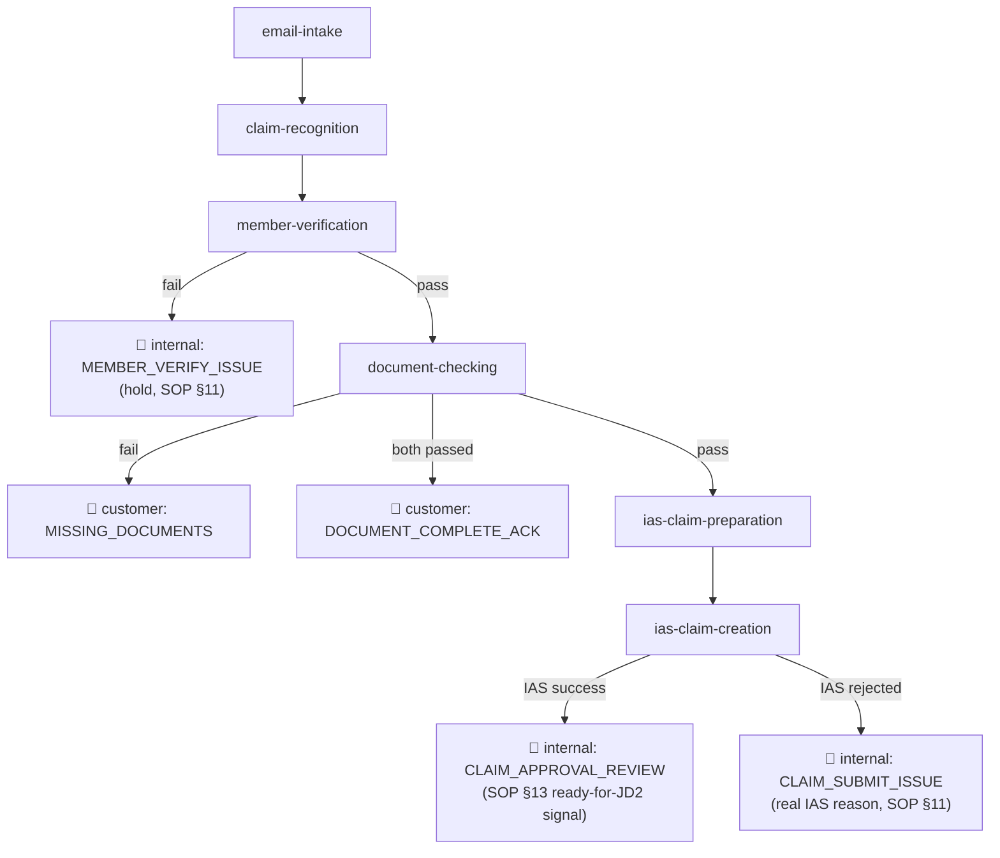

# JD1 Checklist: SOP vs Current System

Source SOP: `JD1_Claim_Document_Checking_and_Member_Verification_SOP V1.docx` (this folder).
Current system: `ulink-admin/src/ulink-api/modules/{document-checking,member-verification,claim-recognition,pipeline}`.

Status legend: ✅ Done · ⚠️ Partial · ❌ Not implemented

Ordered by implementation priority (top = do first). Each item has a checkbox to track work.

---

## Pipeline → Email Map

Every job doesn't just "arrow into a generic email-sender box" — each queues its own named `EmailTask` type, and each type now has a clear, deliberate audience (customer or internal ops). Added 2026-09-14 alongside the internal-vs-customer corrections below, since that distinction wasn't visible anywhere before.

`SUBMISSION_NOT_RECOGNIZED` (customer, `email-intake`/routing can't classify the submission at all) isn't shown above — it's a side-exit from the very start of the pipeline, not a stage-to-stage transition.

---

## 1. Signature & Declaration (SOP §10) — ❌ (deferred by business decision)

**Status 2026-09-14: deliberately not being worked on.** User decision: *"declaration consent we skip first, during demo i will try clarify"* — this is the one remaining open item for document-checking's own scope; everything else below it in this list belongs to other jobs (member-verification) or is now done (see items 2/3).

- [ ] Check `documents_present.has_customer_signature` is `true` before passing JD1 (field lives on the base extraction schema, `20260822090000-add-claim-recognition.js` — this is the claim form's own signature, unrelated to `delegation_letter`, see "already solid" section below).
- [ ] Check declaration/consent checkbox or field is present.
- [ ] Add `MISSING_SIGNATURE` / `MISSING_DECLARATION` to `document-checking/checklist.js` `ISSUES` + `EVALUATORS`.
- [ ] Confirm canned-response wording exists for these (business sign-off if not).
- [ ] Authorized-signer / relationship check (SOP §10's third bullet: "where an authorized person signs on behalf of the claimant, supporting authority/relationship should be checked") has no evaluator today — do not confuse with `delegation_letter` (that's a §9 bank-payee mechanism, see "already solid" section).

**Why first:** zero coverage today, small self-contained addition to an existing file (`checklist.js`), no new module needed. Blocked on business clarifying declaration/consent field shape before implementation, not on engineering complexity.

---

## 2. Mandatory E-Claim Field Completeness (SOP §4) — ✅

**Done 2026-09-14.** All 22 SOP mandatory fields across the 5 non-declaration sections (Submission Info, Policy & Member Info, Claim & Treatment Info, Bank Info) are now covered — the diagnosis field was already a blocking `EVALUATORS` check (`checkIncompleteClaimForm`); every other field was added as a non-blocking `MANDATORY_FIELDS` flag (`checklist.js`), including the four separate Bank Information sub-fields (Name/Address/Account Holder/Account Number — SOP §9 treats these as four separate confirmations, `checkMissingBankInfo` alone only caught all-three-missing) and Appointment/Visited Time (SOP's row is date+time combined, date-only was the initial miss, caught same day). Declaration & Signature section is out of scope here — tracked under item 1 above.

---

## 3. Cross-Document Consistency (SOP §8, items 13-18) — ✅

**Done 2026-09-14.** The old `identity_consistency.patient_name_consistent`/`.medical_record_provider_consistent` fields and their disabled evaluators (`checkIncorrectPatientDetails`, `checkIncorrectMedicalReport`) are gone — removed along with `claim-recognition`'s Task 3 bundled judgment call (root cause of the original false-positive problem: one LLM call doing routing+extraction+judgment together). Replaced with a dedicated module, `modules/document-checking/identityJudgment.js`, isolating each comparison into its own narrow LLM call:

- `entityMatch(a, b)` — "same person/place?" — used for bank-account-holder, delegation-payee, patient name, provider name, hospital name (5 comparisons, items 13-17).
- `meaningMatch(claimText, recordText)` — "does the medical record support the claim's stated diagnosis/treatment?" (item 18) — a support/relevance judgment, not an entity match, per SOP §8's own wording ("Medical Record must support claim").

All 6 run in parallel (`document-checking/service.js`'s `runJudgments`), gated behind stage-1 (deterministic `EVALUATORS`) already passing — same cost-gating as member-verification's exclusion check. All 6 ship as non-blocking `flags`, not blocking `issues` — shadow-first discipline, not yet promoted to a gate. One real false positive was already caught and fixed during validation (hospital short name "Ar Yu" vs full name "Ar Yu International Hospital" judged as different entities) — regression-covered in `tests/documentChecking.judge.test.js`.

Treatment date consistency across Claim Form ↔ Medical Record ↔ Invoice (`checkTreatmentDateConsistency`) was also added this session as a separate non-blocking check — deterministic (Tier 2), not a judgment call.

**Remaining before these can be trusted as blocking gates:** run each against more real cases via the dev preview endpoint (`/api/dev/document-checking/{caseId}/preview`) and watch for further false positives, same rigor that caught the hospital-name issue — no fixed sample-size threshold set yet, business/engineering judgment call when the time comes.

---

## 4. Member Active Status — explicit flag (SOP §6.1) — ✅ (no new check needed, decision documented)

**Resolved 2026-09-14.** Checked a real IAS sample (`docs/imp/day1/IAS/ias_get_member_information_response_v2.json`): both `memberPlans[0].STATUS` and `policies[0].STATUS` come back `null` — not a field this system can reliably gate on. Business-confirmed: `checkCoverageActive`'s existing coverage-period range (`REINST_DATE`/`EFF_DATE`..`TERM_DATE`/`EXP_DATE`) is accepted as the active-status equivalent. Decision comment added directly above `checkCoverageActive` in `member-verification/checks.js`. No new check, no logic change.

---

## 5. Treatment Date vs Submission Date (SOP §6.6) — ❌ (blocked on business rule)

`claim.date_submitted` is already extracted. Code is a one-line date-diff once the actual rule is known — **blocked purely on the permitted-submission-period day limit, tracked in `Demo_Clarifications_Needed.md`.**

- [ ] Define "permitted submission period" — need the actual policy/product rule (days-from-treatment limit). Not in SOP doc itself; check with business or existing policy config.
- [ ] Add as a new check in `member-verification/checks.js`, following `checkCoverageActive`'s null-safe pattern.
- [ ] Decide outcome: hard block (`MEMBER_REVIEW_REQUIRED`) or soft flag for JD2 — SOP says "flag exceptions for assessment," suggesting soft/informational, not a hard gate like coverage/bank/DOB.

**Why fifth:** straightforward date comparison once the permitted-period rule is known — the rule itself is the blocker, not the code.

---

## 6. Treatment Type vs Eligible Benefit (SOP §6.4) — ✅

**Done 2026-09-14.** `uniqueBenefitCandidates()` extracted from `ias-claim-preparation/benefitPicker.js` (private) to `modules/shared/iasBenefits.js` (shared, unchanged behavior) so both jobs reuse the exact same flattening — no duplication. New `modules/member-verification/benefitEligibility.js`, pure/deterministic, no LLM: compares `claim.type_of_patient` against the member's own plan candidates.

**Correction made during implementation:** the original plan (and this doc's earlier text) said to compare `claim.claim_benefit_type` too — checked real fixture data and every case has `claim_benefit_type = "Reimbursement"` regardless of treatment type. It's the claim's *payment mechanism* (Reimbursement/Cashless), not a coverage category — comparing it against IAS benefit-type candidates would have false-flagged every single reimbursement claim. Only `type_of_patient` is actually compared; `claim_benefit_type` deliberately excluded, with the reasoning left in the code comment so it isn't "corrected" back in by mistake later.

Returns a non-blocking `BENEFIT_NOT_ELIGIBLE` flag (SOP: JD1 never rejects on this, only flags for JD2), wired into `member-verification/service.js`'s `result.flags` alongside `POSSIBLE_EXCLUSION`, gated behind the hard checks already passing (noise-reduction, not cost — this check has no LLM). Fixture-tested in `tests/memberVerification.test.js`.

---

## 7. Diagnosis vs Policy Exclusion (SOP §6.3) — ✅

**Correction 2026-09-14: this doc was stale — this item is already built and live**, from earlier the same session as items 13-18 (document-checking's judgment module). `modules/policy-exclusion/{lookup,judge,overrideLookup}.js` implements exactly the RAG-then-judge approach recommended below; wired into `member-verification/service.js`'s `checkExclusions` (`exclusionFlags.js`), gated behind the hard checks passing, output as a non-blocking `POSSIBLE_EXCLUSION` flag with attached policyholder overrides. Kept the investigation notes below for reference since they document the real complications found (prose not codes, not binary, two layers) and how each was actually handled.

- `AYAHealth_Special Conditions and Benefit Clarifications...xlsx` — **not an exclusion list.** Per-policyholder overrides (e.g. HEINEKEN's vaccination-campaign restriction, named-employee maternity waivers, Kachin-staff claim-window extension) and general benefit-interpretation opinions (chronic condition, pre-existing, optical). Relevant as an *override* layer (see below), not the base exclusion source.
- `AYA SOMPO...Policy Wording_English.pdf` — **this is it.** Section 6 "General Exclusions," 41 clauses (6.1–6.41), plus per-section "Specific Exclusions" scattered through Sections 1–4 (Maternity, Thailand Zone, Optical, Dental, Personal Accident). All written as free-text legal clauses (e.g. *"self-inflicted Injury"*, *"Chronic or end-stage kidney failure which... will require... dialysis"*, *"Cosmetic surgery... unless required as a direct result of an Accident"*) — not ICD-10 codes. `diagnosisPicker.js`'s code output doesn't map onto this directly.

Three real complications found, not just "list exists now, ship it":
- [ ] **Prose, not codes** — confirms Tier-4 (free-text diagnosis vs free-text clause), same reasoning shape as identity-consistency judgments, not a set-membership check like item 6.
- [ ] **Not binary** — some clauses are sub-limits, not hard excludes (6.19: HIV/AIDS capped at 7,500,000 MMK, not excluded outright). Output needs excluded / capped / needs-review, not true/false.
- [ ] **Two layers** — product-level base exclusions (the PDF, per insurer/product via `ulink_claim_routes`) + policyholder-level overrides (the xlsx, can permit what the base wording excludes — e.g. TOB's group policy explicitly allows outpatient psychiatric treatment that 6.35 otherwise excludes). Checking the PDF alone will false-flag correctly-covered claims for policyholders with an override on file.
- [ ] Each additional insurer/product route will have its **own** policy wording doc with its own exclusion clauses — this is a recurring ingestion task per product, not a one-time PDF read.

**Recommended approach** (reuses the existing ICD-10 RAG pattern, doesn't invent a new one): digitize Section 6 + specific exclusions into a DB table scoped by route/product; vector-retrieve top-K candidate clauses per claim's diagnosis/treatment text (same shape as `icd10/lookup.js`); one narrow LLM call judges match against the retrieved candidates (same shape as `diagnosisPicker.js`); check the policyholder-override table after, surface both signals to JD2 (SOP: flag only, never decide).

**Why seventh:** genuinely new work now that the source is confirmed — a new table, an ingestion step, and a new narrow LLM call — not a quick flip. Correctly stays lower priority for Module 1, now for a documented reason instead of an unknown one.

---

## 8. Available Benefit Balance (SOP §6.5) — ✅ (placeholder, real integration deferred)

**Done 2026-09-14, as a deliberate placeholder.** User-confirmed decision: show the plan's own filed limit as the "balance" until a real usage-tracked balance API is integrated later — no such live-balance IAS endpoint exists today, so an actual remaining-balance figure isn't available yet. New `modules/member-verification/benefitLimits.js` (`summarizeBenefitLimits`), pure passthrough of `memberPlans[0].coverageLimits[]`'s own annual/per-visit/lifetime amounts — every entry carries a fixed `note` field explicitly stating it's the filed limit, not a usage-adjusted balance, so JD2 can never mistake one for the other. Attached as `result.benefitLimits` on `member-verification`'s result, populated whenever IAS returns data (informational, not gated on the hard checks passing).

**Still open:** real balance integration once an IAS endpoint for it exists — tracked here, not urgent.

---

## 9. Reference Fields Not Extracted (SOP §4 footnote) — ❌

SOP: *"Reference fields to review when available: Date Submitted, Submission Channel, Doctor Name and Treatment Outside Myanmar."* `date_submitted` and `doctor_name` are already in the extraction schema (`synthesize.md`) and used elsewhere (item 5, item 3). `Submission Channel` and `Treatment Outside Myanmar` are **not in the schema at all** — not extracted, not checked, not surfaced anywhere.

- [ ] Confirm with business whether these two are actually needed for JD1 (e.g. does "treatment outside Myanmar" change eligibility/routing?) or were just listed as reference-only in the SOP.
- [ ] If needed: add to `claim-recognition/prompts/synthesize.md` extraction schema, then decide informational-only vs. a new check.

**Why ninth:** explicitly named in the SOP but the business need is unconfirmed — cheap to ask, don't build extraction speculatively.

---

## 10. Explicit "Ready for JD2 Handover" Flag (SOP §13) — ✅ (as a notification, not a stored flag)

**Done 2026-09-14, via the email-internal-vs-customer correction work.** `ias-claim-creation/service.js` now queues an internal-only `CLAIM_APPROVAL_REVIEW` email (`INTERNAL_REVIEW_EMAIL`) the moment a claim is created in IAS — JD1's automated work is complete at that point, and this is the signal that JD2's manual review/approval starts. It replaced the old customer-facing `CLAIM_CREATED_NOTIFICATION` ("your claim number is X"), which this system could never correctly time anyway: `Case.currentStatus` never advances past `CLAIM_CREATED` (final determination is outside JD1 scope, SOP §14), so there was no way to detect when it was actually safe to tell the customer. Telling the customer their claim number is now a manual step for ops once JD2 has actually reviewed/approved — deliberate, not an oversight.

**Not built:** a dedicated stored flag/timestamp on `Case` itself (the email is the signal today, not a queryable field). Revisit only if audit/reporting needs to query "ready for JD2" as case state, not just as a sent-email log.

---

## Reference: already solid, no action needed

- §5 Claim Form Verification (correct insurer form) — `claim-recognition` route decision. Caveat: "form applicable to relevant product/policy" is moot today — the system has exactly one enabled route (Day 1, per `routeCatalog.js`); revisit when a second route/product is added.
- §6.2 Treatment Date vs Coverage Date — `checkCoverageActive`.
- §7 Medical Document Verification (presence/legibility) — `checkNoMedicalReport`, `checkIncompleteMedicalReport`, `checkUnclearVoucher`.
- §8 Amount consistency — `checkVoucherAmountMismatch`.
- §9 Bank Information — `checkMissingBankInfo` + member-verification hard checks (bank name/account name/number vs IAS), plus the four Bank Information completeness flags (item 2). Payee-mismatch sub-case ("account holder name differs from claimant") handled by `checkDelegationLetterRequired`'s logic, now moved into `evaluateJudgmentDependentChecks` (item 3) — **the fraud gap this section used to flag is closed as of 2026-09-14**: the check now fires off the real `bankAccountHolder` entity-match judgment (claimant name vs bank account name), not just "is any delegation letter present." A delegation letter naming the wrong payee no longer silently passes. `delegationPayee` (item 13-17) is a separate, non-blocking flag surfacing when the letter's *named* payee doesn't match the bank account holder — informational for JD2, doesn't gate.
- §11 Missing/Inconsistent Info handling pattern — `ISSUES` + `MEMBER_REVIEW_REQUIRED` reasonCodes. **Real compliance fix, 2026-09-14:** pulled the SOP's actual §11 table text — "Member/policy mismatch" and "Bank detail issue" are both "hold and verify/escalate internally", never a direct customer email, which the system was doing wrong (auto-emailing the customer "please reply with corrected information" for all four `MEMBER_REVIEW_REQUIRED` reasonCodes, including bank mismatches — the exact fraud surface the SOP's "hold payment-related verification" line exists to prevent). `MEMBER_VERIFY_ISSUE` now goes to `INTERNAL_REVIEW_EMAIL` (+ the case's route `cc_email`) instead of the customer, with the real reasonCode/diagnostic detail — see `modules/email-sender/service.js`'s `INTERNAL_ONLY_TASK_TYPES` and `templates.js`'s `renderMemberVerifyIssue`. Document-checking's `MISSING_DOCUMENTS` is unaffected — the SOP does frame that one as customer-facing.
- §14 JD1 doesn't auto-decide — respected throughout, system only flags/escalates.
